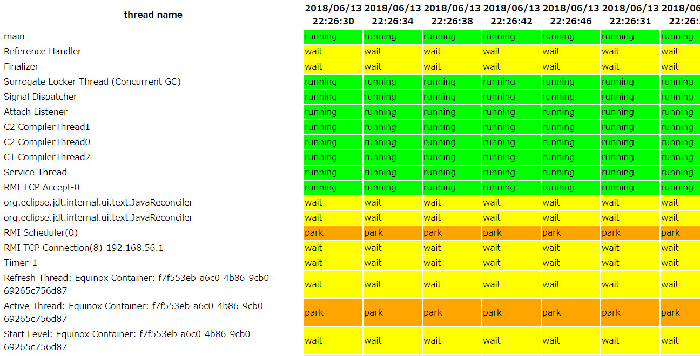
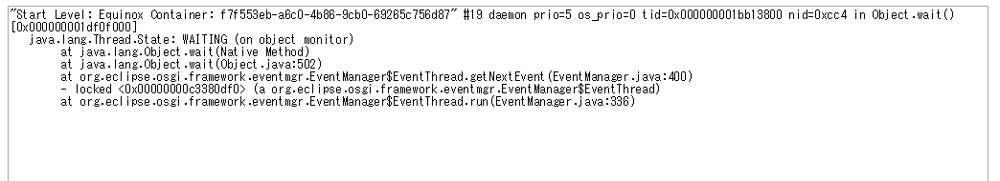

# About jfr_thread_visualizer

jfr_thread_visualizer is a tool for outputting time series thread dump information recorded in jfr file into html format.
It is an experimental tool and I does not guarantee the quality.



## Requirement
- JDK 8 or higher
- In the environment of JDK 9 or higher, it is necessary to specify the path of JDK 8 with the environment variable `JAVA8_HOME`


## How To Execute
```
bin\jfr_thread_visualizer.bat ${jfr_file}
```

例
```
jfr_thread_visualizer.bat C:\sample\sample/jfr
```

If execution is successful, `thread_table.html` is created.
When you click on the status column, the thread details are displayed in the new tab.


